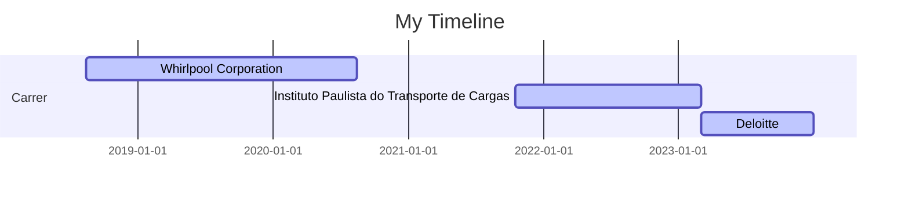

### Hi there, I'm Bruno!

### Educational Background 🎓
I hold a degree in Computer Engineering from São Judas Tadeu University in São Paulo, the city where I was born, raised, studied, and currently reside

### Profissional 🏢
I have been working in the field of data since 2018, uncovering how data can assist us with insights, problem-solving, and business decision-making. Since then, I've journeyed through different companies, where my current role is as a Business Analyst at Deloitte. I support M&A and Due Diligence processes by creating ETL workflows, automating/defining processes, and analyzing data.

### Professional Experience

🛒 Service Engineer Internship - Whirlpool Corporation (08.2018 - 08.2020)   

📘 Data Analyst - Instituto Paulista do Transporte de Cargas  (10.2021 - 03.2023)   

💻 Business Analyst - Deloitte  (03.2023 - atual)   

### Education

🗞️ Computer Engineering - Universidade São Judas Tadeu (2016 - 2021)

### Licenses & certifications
SQL Beginner to Advanced For Data Professionals - Codebasics (Jan 2023)   

Taming Big Data with Apache Spark and Python - Hands On! - Udemy (Jan 2023)   

Crash Course on Python - Coursera (Oct 2020)   

Neural Networks and Deep Learning - Coursera (Oct 2020)   

Yellow Belt Lean Six Sigma OpEx - Whirlpool Corporation (Oct 2019)   

 
### Skills:

  
  
  
  
  
  
  
  

  
  
  
  
  

 

---

