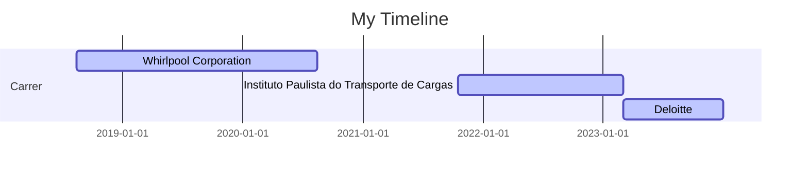

### Hi there, I'm Bruno!

### Educational Background 🎓
I hold a degree in Computer Engineering from São Judas Tadeu University in São Paulo, the city where I was born, raised, studied, and currently reside

### Profissional 🏢
Trabalho na área de dados desde 2018, descobrindo como os dados podem nos ajudar com insights, resolução de problemas e tomadas de decisões nos negócios. De lá para cá passei por diferentes empresas, onde minha atual posição é coomo Analisa de Negócios na Deloitte, acessorando processos de M&A e Due Dillengence com criação de fluxos de ETL, automatização/definição de processos e análise de dados.

### Professional Experience

🛒 Service Engineer Internship - Whirlpool Corporation (08.2018 - 08.2020) 
📘 Data Anlyst - Instituto Paulista do Transporte de Cargas  (10.2021 - 03.2023)
💻 Business Analyst - Deloitte  (2023-03 - atual)

### Education

🗞️ Computer Engineering - Universidade São Judas Tadeu (2016 - 2021)

### Licenses & certifications
SQL Beginner to Advanced For Data Professionals - Codebasics (Jan 2023)
Taming Big Data with Apache Spark and Python - Hands On! - Udemy (Jan 2023)
Crash Course on Python - Coursera (Oct 2020)
Neural Networks and Deep Learning - Coursera (Oct 2020)
Yellow Belt Lean Six Sigma OpEx - Whirlpool Corporation (Oct 2019)

### Languages and Tools:

  
  
  
  
  
  
  
  
  

  
  
  
  
  
  
  
  
  
      

---

